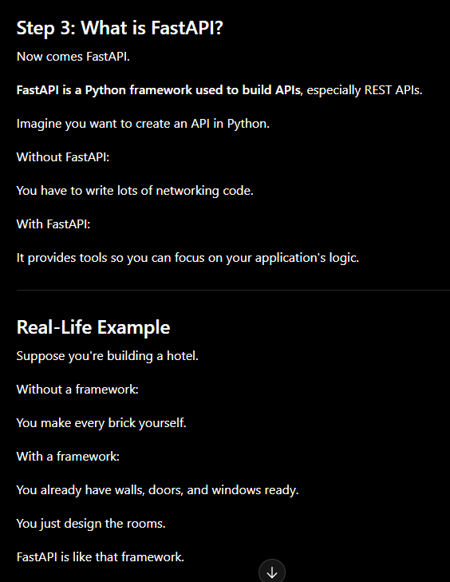

## API
- An API (application programming interface) is a defined set of rules that allows one piece of software to request data or actions from another. It specifies how requests are made, what information is exchanged, and how responses are returned, so systems can interact without exposing their internal code.

- ex: the time and date automatically sync on your laptop when you travel to another time zone.


## joblib
- Joblib is a Python library used to save Python objects to a file and load them back later.

- In Machine Learning, the object is usually a trained model.

- Think of it like this:You spent 30 minutes training a Random Forest model.Instead of training it again every time you run your program, you save it.Later, you simply load it and start predicting.

- This saves time and computing power

```py
It can save almost any Python object.

Example:

List

numbers = [10,20,30]
```

- Joblib is used to serialize (save) and deserialize (load) trained machine learning models and other Python objects. It allows us to train a model once, save it to disk, and reuse it later without retraining, making deployment much faster. It is generally preferred over pickle for scikit-learn models because it is optimized for large NumPy arrays.

## pickle
- What is Pickle?

- Pickle is a built-in Python module used to save Python objects into a file and load them back later.

- It is called serialization.

- Saving an object → Serialization(Pickling)
- Loading an object → Deserialization (Unpickling)

- Think of it as storing an object in a file so you can use it later without creating it again.

## REST API?
- REST stands for:

    - Representational State Transfer

    - Don't worry about memorizing the full form. Focus on the idea.

    - A REST API is a way of designing APIs using standard HTTP methods.

    - Think of it as a set of rules for how clients and servers should communicate.
    - ```py
          The Four Main HTTP Methods
      1. GET → Read data

      Example:

      GET /students

      Meaning:

      Give me all students.

      Response:

      [
        {
          "name": "Keertana"
        },
        {
          "name": "Rahul"
        }
      ]
      2. POST → Create data

      Example:

      POST /students

      You send:

      {
        "name": "Keertana"
      }

      The server stores it.

      3. PUT → Update data

      Example:

      PUT /students/1

      Meaning:

      Update student number 1.

      4. DELETE → Remove data

      Example:

      DELETE /students/1

      Meaning:

      Delete student number 1.

      REST API Flow

      Suppose you're building a student management system.

      Browser

      ↓

      GET /students

      ↓

      Server

      ↓

      Returns Student List

      Or

      Browser

      ↓

      POST /students

      ↓

      Server

      ↓

      Creates Student

      ↓

      Returns Success
  ```


## Fast API
- 

```py
Why is it called FastAPI?

It is called FastAPI because:

It is fast to develop (less code).
It is fast to run (high performance, thanks to modern Python technologies).
Where is FastAPI Used?

Many backend services use FastAPI for:

Machine Learning model deployment
AI applications
Chatbots
Recommendation systems
E-commerce backends
Banking APIs
Mobile app backends
```

## curl
```py
In FastAPI, cURL is a tool used to send requests to your API from the command line.

The full form of cURL is:

Client URL

It allows you to test your API without creating a frontend application.

Think of cURL as a client that talks to your FastAPI server.
```
## HTTP methods
You are right. My previous explanation was more like a **quick summary**. For learning properly, you need:

1. **Definition** → What exactly it is
2. **Why we use it** → The purpose
3. **Where we use it** → Real-world usage
4. **How we use it** → Syntax / implementation
5. **Example** → Practical understanding
6. **Difference table** → Compare concepts

Let's explain HTTP methods properly.

---

# What are HTTP Methods?

## Definition

**HTTP methods are predefined actions in the HTTP protocol that tell the server what operation the client wants to perform on a resource.**

In simple words:

> HTTP methods are commands sent by a client (browser, mobile app, Postman, cURL) to tell a server what to do with data.

Example:

A client can tell a server:

* Give me data → GET
* Store new data → POST
* Modify existing data → PUT
* Remove data → DELETE

---

# Why do we use HTTP Methods?

We use HTTP methods because the client and server need a standard way to communicate.

Without HTTP methods, the server would not know what the client wants.

Example:

Suppose you send:

```
/users
```

The server doesn't know:

* Do you want to see users?
* Add a user?
* Delete a user?
* Update a user?

HTTP methods solve this problem.

Example:

```
GET /users
```

means:

"Give me users."

```
POST /users
```

means:

"Create a new user."

---

# Where do we use HTTP Methods?

HTTP methods are used everywhere where applications communicate through the internet.

Examples:

### 1. Websites

When you open Instagram:

```
GET /posts
```

Instagram sends your posts.

---

### 2. Mobile Applications

When you login:

```
POST /login
```

Your username and password are sent to the server.

---

### 3. E-commerce Applications

Amazon:

```
GET /products
```

Fetch products.

```
POST /orders
```

Create an order.

---

### 4. Machine Learning APIs

Your FastAPI prediction project:

```
POST /predict
```

You send input data.

The model predicts and returns the result.

---

# Main HTTP Methods

The four most commonly used methods are:

1. GET
2. POST
3. PUT
4. DELETE

---

# 1. GET Method

## Definition

**GET method is used to request and retrieve data from a server.**

It is used when the client only wants to **read information**.

---

## Why do we use GET?

We use GET when:

* We need information from the server.
* We don't want to modify any data.
* We only want to view resources.

---

## Where do we use GET?

Examples:

### User profile

```
GET /users/101
```

Meaning:

"Give me details of user 101."

---

### Product list

```
GET /products
```

Meaning:

"Show me all products."

---

### ML Example

Getting model information:

```
GET /model-info
```

Response:

```json
{
 "model":"Random Forest",
 "accuracy":95
}
```

---

## How to use GET in FastAPI?

```python
from fastapi import FastAPI

app = FastAPI()

@app.get("/students")
def get_students():
    return {
        "name":"Keertana",
        "branch":"CSE"
    }
```

When the client sends:

```
GET /students
```

FastAPI returns:

```json
{
 "name":"Keertana",
 "branch":"CSE"
}
```

---

# 2. POST Method

## Definition

**POST method is used to send data to a server to create a new resource or process some data.**

The client sends information inside the request body.

---

## Why do we use POST?

We use POST when:

* We need to send data to the server.
* We want to create something new.
* The request contains sensitive or large data.

---

## Where do we use POST?

### User Registration

```
POST /register
```

Sending:

```json
{
"name":"Keertana",
"email":"abc@gmail.com"
}
```

Server creates a new account.

---

### Login

```
POST /login
```

Sending:

```json
{
"username":"user1",
"password":"12345"
}
```

---

### Machine Learning Prediction

Your FastAPI project:

```
POST /predict
```

Input:

```json
{
"sepal length (cm)":5.1,
"sepal width (cm)":3.5,
"petal length (cm)":1.4,
"petal width (cm)":0.2
}
```

Server:

```
Model.predict()
```

Output:

```json
{
"prediction":"setosa"
}
```

---

## How to use POST in FastAPI?

```python
@app.post("/students")
def create_student(student):
    return {
        "message":"Student created",
        "data":student
    }
```

Client sends:

```json
{
"name":"Keertana"
}
```

Server responds:

```json
{
"message":"Student created"
}
```

---

# 3. PUT Method

## Definition

**PUT method is used to update or replace existing data on the server.**

---

## Why do we use PUT?

We use PUT when:

* Existing information needs modification.
* We want to update a complete resource.

---

## Where do we use PUT?

Example:

Updating a profile.

Before:

```json
{
"name":"Keertana",
"branch":"CSE"
}
```

Request:

```
PUT /users/1
```

Sending:

```json
{
"name":"Keertana",
"branch":"AI"
}
```

After:

```json
{
"name":"Keertana",
"branch":"AI"
}
```

---

## FastAPI Example

```python
@app.put("/users/{id}")
def update_user(id:int):
    return {
        "message":"User updated"
    }
```

---

# 4. DELETE Method

## Definition

**DELETE method is used to remove a resource from the server.**

---

## Why do we use DELETE?

We use DELETE when:

* We want to permanently remove data.
* The resource is no longer required.

---

## Where do we use DELETE?

Examples:

Delete account:

```
DELETE /users/10
```

Delete product:

```
DELETE /products/5
```

---

## FastAPI Example

```python
@app.delete("/users/{id}")
def delete_user(id:int):
    return {
        "message":"User deleted"
    }
```

---

# GET vs POST Difference

| Feature          | GET                                   | POST                                  |
| ---------------- | ------------------------------------- | ------------------------------------- |
| Purpose          | Retrieve data from server             | Send data to server                   |
| Operation        | Read                                  | Create/Process                        |
| Data location    | Sent through URL/query parameters     | Sent through request body             |
| Used for         | Fetching information                  | Creating resources or submitting data |
| Data visibility  | Data is visible in URL                | Data is hidden inside request body    |
| Security         | Less secure for sensitive data        | Better for sensitive data             |
| Data size        | Limited because URL has length limits | Can send larger data                  |
| Browser behavior | Can be bookmarked                     | Cannot usually be bookmarked          |
| Idempotent       | Yes (same request gives same result)  | Usually no                            |
| Example          | View profile, search products         | Login, registration, ML prediction    |

---

# Complete Flow Example

Suppose you have a student application.

### Get all students

```
GET /students
```

Response:

```json
[
{
"name":"Keertana"
}
]
```

---

### Create student

```
POST /students
```

Request:

```json
{
"name":"Rahul"
}
```

---

### Update student

```
PUT /students/1
```

Request:

```json
{
"name":"Rahul Kumar"
}
```

---

### Delete student

```
DELETE /students/1
```

Response:

```json
{
"message":"Deleted"
}
```

---

## Simple Memory Trick

```
GET     → Give me data
POST    → Send/create new data
PUT     → Update existing data
DELETE  → Remove data
```

For your **FastAPI + Machine Learning projects**, you will mostly use:

```
POST /predict
```

- because the user sends input features → model predicts → API returns the result.

